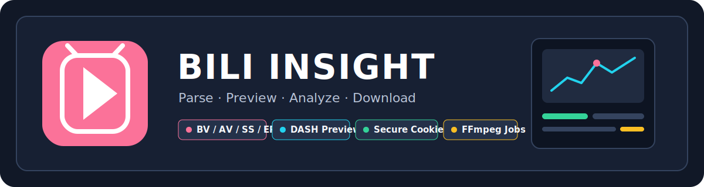

<div align="center">
  
  <h1>Bili Insight</h1>
  <p>面向本地单用户与可信环境的 Bilibili 视频解析、在线播放、分析与下载工作台</p>
  <p>支持普通 BV/AV 投稿与番剧 SS/EP，匿名优先，也可使用用户主动上传的 Cookie 获取账号实际拥有的媒体规格。</p>
  <p>
    <a href="https://github.com/JunWan666/bili-insight/releases/latest"></a>
    <a href="https://github.com/JunWan666/bili-insight/actions/workflows/ci.yml"></a>
    <a href="https://github.com/JunWan666/bili-insight/actions/workflows/publish-images.yml"></a>
    <a href="https://github.com/JunWan666/bili-insight/stargazers"></a>
  </p>
  <p>
    
    
    
    
    
  </p>
  <p>
    
    
    
    
    
  </p>
  <p>
    <a href="#项目亮点">项目亮点</a>
    ·
    <a href="#功能概览">功能概览</a>
    ·
    <a href="#快速开始">快速开始</a>
    ·
    <a href="#公开入口">公开入口</a>
    ·
    <a href="#安全边界">安全边界</a>
    ·
    <a href="#项目文档">项目文档</a>
  </p>
</div>

> [!IMPORTANT]
> 本项目只用于处理使用者有权访问和使用的内容，不绕过付费、DRM、验证码、平台风控或其他访问控制。Cookie 等同账号会话凭据，请勿分享、提交到 Git 或发送给第三方。

## 公开入口

| 入口 | 地址 |
| --- | --- |
| GitHub 源码 | [JunWan666/bili-insight](https://github.com/JunWan666/bili-insight) |
| 最新版本 | [GitHub Releases](https://github.com/JunWan666/bili-insight/releases/latest) |
| Linux/macOS 部署脚本 | [deploy.sh](https://github.com/JunWan666/bili-insight/releases/latest/download/deploy.sh) |
| Windows 部署脚本 | [deploy.ps1](https://github.com/JunWan666/bili-insight/releases/latest/download/deploy.ps1) |
| Compose 文件 | [docker-compose.yml](https://github.com/JunWan666/bili-insight/releases/latest/download/docker-compose.yml) |
| GHCR 环境文件 | [ghcr-compose.env](https://github.com/JunWan666/bili-insight/releases/latest/download/ghcr-compose.env) |
| 问题反馈 | [GitHub Issues](https://github.com/JunWan666/bili-insight/issues) |
| 构建状态 | [GitHub Actions](https://github.com/JunWan666/bili-insight/actions) |

## v1.2.5 发布重点

- 重构解析首页的品牌表达与登录态布局，在桌面和移动端保持单屏核心流程。
- 修复番剧重新解析与刷新媒体流时的剧集序号冲突，长 Season 可稳定更新全部分集。
- 完善 tag 发布自动化：前后端镜像发布成功后自动创建 GitHub Release，并附加 Compose 与 GHCR 配置文件。
- Release 部署配置固定使用 `v1.2.5` 镜像；同时继续发布 `latest` 与提交 SHA 标签。

## 项目亮点

- **匿名优先**：无需登录即可解析公开媒体；仅在用户明确选择后使用已校验的 Cookie 登录态。
- **投稿与番剧统一工作流**：支持完整 Bilibili URL、裸 BV/AV 号、`ss28747`、`ep733316` 等标识，EP 链接会自动定位对应剧集。
- **先播放再下载**：选择视频清晰度和音轨后，可预览完整音视频，也可单独试听所选音轨，再决定是否创建下载任务。
- **真实媒体能力**：分别展示分辨率、帧率、编码、HDR、码率、音频和预估大小，不把理论档位当作可用流。
- **媒体与内容分析**：提供 FFprobe、响度、频谱、镜头、关键帧、字幕、ASR、OCR 和证据摘要能力。
- **应用安全与任务复用**：本机管理员登录保护业务接口；相同下载/分析请求自动复用并按视频聚合展示。
- **任务与产物管理**：任务支持单项/批量删除，最近解析在 1440 桌面使用五列竖向媒体卡；产物按视频折叠聚合，并保留批量下载、批量删除与清理能力。
- **桌面与移动端适配**：桌面端使用可折叠侧栏、同风格设置二级菜单和单屏解析工作台；七个设置分组拥有独立 URL，移动端使用五项底部导航与紧凑分组选择器。
- **凭据与媒体地址隔离**：Cookie、签名 URL 和本地绝对路径不会回显到前端或写入普通日志。

## 技术栈

<table>
  <tr>
    <td align="center" width="25%">
      <strong>前端应用</strong><br /><br />
      Vue 3 · TypeScript<br />Element Plus · Pinia<br />Vue Router · Vite
    </td>
    <td align="center" width="25%">
      <strong>后端服务</strong><br /><br />
      FastAPI · Pydantic<br />SQLAlchemy · Alembic<br />HTTPX · SQLite
    </td>
    <td align="center" width="25%">
      <strong>媒体处理</strong><br /><br />
      Shaka Player · DASH<br />FFmpeg · FFprobe<br />SSE · HTTP Range
    </td>
    <td align="center" width="25%">
      <strong>质量保障</strong><br /><br />
      Pytest · Vitest<br />Playwright · Ruff<br />mypy · ESLint
    </td>
  </tr>
</table>

## 功能概览

### 链接解析与登录态

- 支持 `BV`、`AV`、`SS`、`EP` 及对应完整 HTTPS 链接。
- 自动清理 `spm_id_from`、`vd_source` 等无关跟踪参数，保留分 P 定位参数。
- 支持“自动（优先匿名）”“仅匿名”“使用登录态”三种解析策略。
- 设置页可上传浏览器导出的 Cookie JSON，校验登录与大会员状态，并支持替换、重新校验和彻底清除。
- Cookie 可仅在当前会话使用，也可使用本机密钥认证加密后保存。
- 首次访问先创建唯一的本机管理员账号；应用管理员会话与 Bilibili Cookie 登录态相互独立。

### 清晰度、预览与下载

- 同一清晰度下分别展示 H.264、HEVC、AV1 等编码，以及 AAC、FLAC、杜比等音轨。
- 支持最佳画质、最佳兼容、最小体积、仅音频和自定义选择。
- “下载音频”入口支持 M4A 原始封装、MP3 与 FLAC 转码，产物类型明确标记为音频。
- “试听音频”入口使用短期同源 DASH 会话播放当前所选音轨，无需先下载完整文件。
- 使用 Shaka Player 播放当前选择的 DASH 视频与音频，不自动切换到其他清晰度。
- 浏览器不支持 HEVC、AV1 或 HDR 时给出兼容性提示，原规格仍可下载。
- 下载任务开始前刷新并验证临时媒体地址，支持 DASH 音视频合并、封装与可选转码。

### 分析与产物

- 技术分析：媒体参数、响度、静音、频谱、镜头、关键帧与时间线图表。
- 内容分析：公开字幕、ASR、OCR、章节、关键词和带证据定位的摘要。
- 任务中心：按视频聚合相关任务，查看阶段、进度、速度和失败原因；终态任务支持单项/批量删除，已有产物会转为可继续管理的受管保留文件。
- 最近解析：独立页面以紧凑横向条目展示历史记录，每条记录提供独立删除入口；有关联任务或分析的数据会被安全阻止删除。
- 产物中心：默认按视频标题折叠展示产物数量、总大小、类型和最新时间，展开后可预览、保存、单项/批量删除并跳转官方源视频。

## 系统架构

```text
浏览器 / Shaka Player
        │ REST · SSE · 同源 DASH Range
        ▼
Nginx :8080 ─────────────── FastAPI :8000
                                  │
                ┌─────────────────┼──────────────────┐
                ▼                 ▼                  ▼
          Bilibili Provider   Preview Service   Download / Analysis
                │            短期 MPD 与代理       FFmpeg / Models
                └─────────────────┼──────────────────┘
                                  ▼
                         SQLite · Artifacts
```

Docker 默认只把 Nginx 发布到 `127.0.0.1`；需要手机访问时可显式改为局域网监听。FastAPI 始终位于 Compose 内部网络，不直接暴露主机端口。运行数据与 Cookie 加密密钥分别存放在独立命名卷中。

## 快速开始

### 一键部署（推荐）

环境要求：Docker Engine 24+、Docker Compose 2.24+。脚本不会静默安装 Docker，也不会在普通卸载时删除数据库、产物或 Cookie 密钥卷。

Linux / macOS：

```bash
curl -fsSL https://github.com/JunWan666/bili-insight/releases/latest/download/deploy.sh -o /tmp/bili-insight-deploy.sh && bash /tmp/bili-insight-deploy.sh
```

Windows PowerShell：

```powershell
$script = Join-Path $env:TEMP "bili-insight-deploy.ps1"
Invoke-WebRequest -UseBasicParsing https://github.com/JunWan666/bili-insight/releases/latest/download/deploy.ps1 -OutFile $script
powershell -NoProfile -ExecutionPolicy Bypass -File $script
```

脚本提供部署/更新、重启、状态、日志、保留数据卸载和彻底卸载菜单。默认使用 `auto` 模式：优先拉取对应版本的 GHCR 镜像；若包尚未开放匿名拉取或网络不可用，则自动下载同一 Release 的源码并在本机完成 Docker 构建，不需要 GitHub Token。

不进入菜单也可以直接执行：

```bash
bash /tmp/bili-insight-deploy.sh deploy --host 0.0.0.0 --port 8080 --mode auto
```

```powershell
powershell -NoProfile -ExecutionPolicy Bypass -File $script -Action Deploy -HostAddress 0.0.0.0 -Port 8080 -Mode auto
```

> [!TIP]
> 建议先通过上面的公开链接阅读脚本源码。重复运行同一脚本即可更新；现有 `.env`、监听地址、端口、命名卷和用户数据会保留。命令行或环境变量中显式提供的新地址和端口始终优先。

### 公开 Release 文件部署

不使用管理脚本时，也可以直接下载最新 Release 附件。以下链接无需仓库 Token：

Linux / macOS：

```bash
mkdir -p bili-insight && cd bili-insight
curl -fsSL https://github.com/JunWan666/bili-insight/releases/latest/download/docker-compose.yml -o docker-compose.yml
curl -fsSL https://github.com/JunWan666/bili-insight/releases/latest/download/ghcr-compose.env -o .env
docker compose pull
docker compose up --detach --no-build --wait
```

Windows PowerShell：

```powershell
New-Item -ItemType Directory -Force bili-insight | Out-Null
Set-Location bili-insight
Invoke-WebRequest -UseBasicParsing https://github.com/JunWan666/bili-insight/releases/latest/download/docker-compose.yml -OutFile docker-compose.yml
Invoke-WebRequest -UseBasicParsing https://github.com/JunWan666/bili-insight/releases/latest/download/ghcr-compose.env -OutFile .env
docker compose pull
docker compose up --detach --no-build --wait
```

如果 `docker compose pull` 返回 `401/403`，说明 GHCR 包仍要求登录。此时直接改用一键脚本的 `auto`/`source` 模式，或按下一节从公开源码构建。

### 从公开源码构建

该方式完全基于公开 GitHub 源码，不依赖 GHCR：

```bash
git clone https://github.com/JunWan666/bili-insight.git
cd bili-insight
cp .env.example .env
docker compose up --detach --build --wait
```

Windows PowerShell：

```powershell
git clone https://github.com/JunWan666/bili-insight.git
Set-Location bili-insight
Copy-Item .env.example .env
docker compose up --detach --build --wait
```

当前正式 GHCR 镜像以 `linux/amd64` 为发布基线。ARM64 主机建议使用源码构建模式，让 Docker 在目标主机生成原生架构镜像。

### 手动选择 GHCR 版本

当前正式版本镜像地址：

```text
ghcr.io/junwan666/bili-insight-backend:v1.2.5
ghcr.io/junwan666/bili-insight-frontend:v1.2.5
```

对应 `.env` 配置：

```dotenv
BACKEND_IMAGE=ghcr.io/junwan666/bili-insight-backend:v1.2.5
FRONTEND_IMAGE=ghcr.io/junwan666/bili-insight-frontend:v1.2.5
```

更新时重新下载 Latest Release 的 `.env`，或手动把两个镜像标签改为相同版本，然后执行：

```bash
docker compose pull
docker compose up --detach --no-build --force-recreate --wait
```

启动后访问：

- 应用首页：<http://127.0.0.1:8080>
- 健康检查：<http://127.0.0.1:8080/healthz>

停止服务但保留数据库、产物与密钥：

```bash
docker compose down
```

> [!CAUTION]
> 不要使用 `docker compose down --volumes`，除非已经确认要永久删除全部应用数据和本机 Cookie 解密能力。

### 本机开发

环境要求：Python 3.12+、Node.js 22+、npm 10+、FFmpeg 与 FFprobe。

Windows：

```powershell
.\scripts\bootstrap.ps1
.\scripts\start-dev.ps1
```

Linux/macOS：

```bash
make bootstrap
make dev
```

开发地址为 <http://127.0.0.1:5173>，Vite 会将 `/api` 同源代理到 <http://127.0.0.1:8000>。

### 局域网访问

Docker 模式在 `.env` 中设置：

```dotenv
WEB_HOST=0.0.0.0
WEB_PORT=8080
```

重新创建前端网关后，同一局域网内的设备可访问 `http://<电脑局域网IP>:8080`：

```bash
docker compose up --detach --force-recreate frontend
```

Windows 开发模式也可直接启动局域网监听：

```powershell
.\scripts\start-dev.ps1 -HostAddress 0.0.0.0
```

Linux/macOS 开发模式：

```bash
VITE_DEV_HOST=0.0.0.0 make dev
```

局域网模式只暴露 Nginx 或 Vite，FastAPI 仍保持内部访问。请仅在可信家庭或办公网络使用，使用结束后把 `WEB_HOST` 改回 `127.0.0.1`；若手机无法连接，请检查主机防火墙是否允许对应的 TCP 端口。

## 常用命令

| 命令 | 作用 |
| --- | --- |
| `make test` | 执行后端 Pytest 与前端 Vitest |
| `make lint` | 执行 Ruff、mypy、ESLint 和 TypeScript 检查 |
| `make build` | 编译 Python 模块并生成前端生产构建 |
| `make compose-config` | 验证 Docker Compose 配置 |
| `make docker-build` | 构建前后端生产镜像 |
| `make docker-up` | 构建并启动容器，等待健康检查 |
| `make docker-logs` | 跟踪容器日志 |

前端端到端测试使用脱敏固定 API fixture，不访问真实 Bilibili，也不会读取本机 Cookie 文件。

## 项目结构

```text
bili-insight/
├── backend/                  # FastAPI、Provider、任务与媒体服务
├── frontend/                 # Vue 3 响应式 Web 应用
├── docker/                   # 前后端镜像与 Nginx 配置
├── docs/                     # PRD、部署、安全与实施状态文档
├── scripts/                  # 一键部署、初始化、开发启动与凭据扫描脚本
├── docker-compose.yml        # 本地生产化编排
└── README.md
```

## 可选分析能力

基础媒体探测、响度/静音、镜头、关键帧、字幕导出与证据摘要属于核心安装。ASR 与 OCR 需要额外运行时：

```powershell
# 只安装 ASR
python -m pip install -e ".\backend[analysis-asr]"

# 同时安装 ASR 与 OCR
python -m pip install -e ".\backend[analysis]"
```

Docker 可在 `.env` 中设置 `BACKEND_EXTRAS=analysis-asr`、`analysis-ocr` 或 `analysis` 后重新构建。ASR 首次运行可能下载模型；GPU OCR 需要按 PaddlePaddle 官方兼容矩阵安装匹配 CUDA 的运行时。

## 安全边界

- 真实 `*.cookies.json`、`.env`、运行目录、下载、临时文件和密钥均被 Git 与 Docker 构建上下文排除。
- Cookie 上传后不由前端回显，只按域和 Path 规则发送到允许的 Bilibili 服务。
- 在线预览仅向浏览器暴露同源短期会话地址；MPD 不包含 Cookie 或 Bilibili 签名媒体 URL。
- 媒体代理会校验公网 DNS、固定连接 IP、TLS SNI、CDN 域名、MIME、Range 与响应长度。
- 默认只监听回环地址；应用自带本机管理员鉴权，开放到长期局域网或公网前仍必须增加 HTTPS、限流和严格代理边界。
- CI、固定测试数据、截图和诊断导出不得包含真实 Cookie、账号标识或永久私钥。

## 配置与数据

根目录 `.env.example` 是无敏感信息的 Compose 配置模板。完整变量说明见 [部署运维说明](docs/DEPLOYMENT.md)。

| 数据位置 | 内容 |
| --- | --- |
| `bili-insight-runtime` | SQLite、产物、临时状态和应用日志 |
| `bili-insight-secrets` | Cookie 认证加密主密钥 |
| 本机 `runtime/` | 开发环境数据库、产物、临时文件和日志 |

备份时必须同时覆盖业务卷与密钥卷，并作为两份受控敏感备份分别保存。缺少密钥卷时，已加密保存的 Cookie 无法恢复，但不会影响已经生成的媒体产物。

## 项目文档

- [产品需求文档](docs/PRD.md)：产品范围、业务流程、验收标准与迭代计划。
- [部署运维说明](docs/DEPLOYMENT.md)：环境变量、Docker、本机开发、备份与恢复。
- [安全说明](docs/SECURITY.md)：Cookie、媒体代理、网络部署与威胁边界。
- [实施状态](docs/IMPLEMENTATION_STATUS.md)：当前功能完成情况、测试基线与已知边界。

## 合规说明

本项目不提供绕过付费、DRM、验证码、地区限制或平台风控的能力，不提供 Cookie 分享或账号交易功能。下载与使用行为应遵守 Bilibili 平台条款以及所在地版权法律，使用者需自行确认对目标内容拥有相应访问和使用权限。
