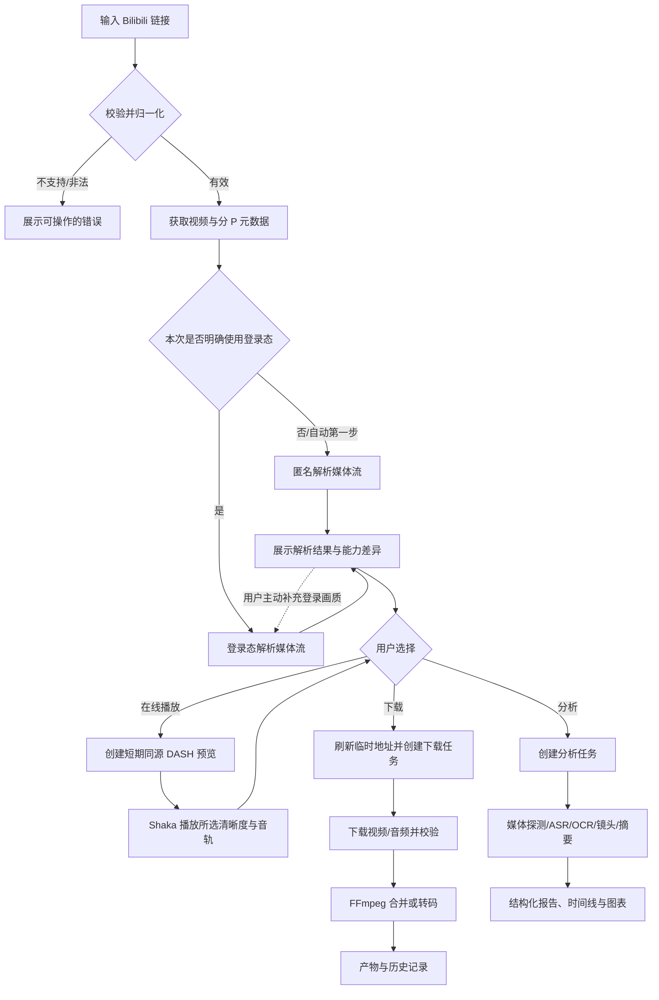

# Bilibili 视频解析、在线播放、分析与下载工具——产品需求文档

| 项目 | 内容 |
| --- | --- |
| 文档版本 | v0.3 Implementation-aligned |
| 文档日期 | 2026-07-15 |
| 产品形态 | 响应式 Web 应用，优先本地部署或可信内网使用 |
| 拟定技术栈 | Python + FastAPI；Vue 3 + TypeScript + Element Plus + ECharts |
| 首版用户模型 | 单机单管理员；应用管理员登录与 Bilibili Cookie 登录态相互独立 |

## 1. 文档目的

本文档用于定义一个 Bilibili 视频解析、内容分析与下载工具的产品范围、用户流程、功能要求、技术边界、验收标准和迭代计划，可作为产品设计、前后端开发、测试和后续排期的共同依据。

本文档同时作为产品需求与当前实现的验收基线。技术选型已经落地为 Python 3 / FastAPI、Vue 3 / TypeScript / Element Plus / ECharts，并使用 Shaka Player 完成浏览器 DASH 预览。

## 2. 项目结论与难度评估

### 2.1 结论

需求可实现，整体属于中高难度：

- 做出“输入链接 → 解析信息 → 选择清晰度 → 下载并合并”的个人可用 MVP，难度中等。
- 加入 Cookie 安全存储、任务恢复、ASR、OCR、视觉理解和移动端良好体验后，难度明显上升。
- 若进一步做成公网、多用户、可长期运营的 SaaS，需要解决用户隔离、配额、风控、版权、密钥管理和大规模媒体处理，难度较高。

### 2.2 模块难度

| 能力 | 难度 | 主要难点 |
| --- | --- | --- |
| 普通 BV/AV 链接解析 | 低—中 | URL 归一化、分 P、上游字段变化 |
| 番剧 `ss/ep` 链接解析 | 中 | Season/Episode 映射、剧集默认选中、PGC 权益与普通投稿隔离 |
| 未登录媒体流解析 | 中 | 匿名权限差异、临时播放地址、接口风控 |
| Cookie 登录态 | 中—高 | 格式兼容、域/path/过期语义、加密与日志脱敏 |
| 多清晰度下载 | 中 | DASH 音视频分离、编码兼容、FFmpeg 合并 |
| 浏览器在线播放预览 | 中—高 | SegmentBase MPD、Range 代理、签名地址保护、浏览器编码兼容 |
| 下载队列与断点续传 | 高 | 地址过期、任务状态一致性、磁盘与失败恢复 |
| 媒体技术分析 | 中 | FFprobe、响度/频谱/镜头统计与结果可视化 |
| ASR/OCR/视觉理解 | 中—高 | 性能、模型成本、准确率、长视频任务编排 |
| AI 内容总结 | 高 | 幻觉、证据定位、隐私、成本与模型版本管理 |
| 移动端适配 | 中 | 表格、参数表单、任务进度和文件保存体验 |
| 公网多用户部署 | 高 | 应用鉴权、租户隔离、Cookie 安全与滥用风险 |

### 2.3 粗略工作量

以下为一名熟悉 Python、Vue 和 FFmpeg 的全栈开发者的参考值，不包含上游接口大改、模型训练及应用商店上架：

| 阶段 | 参考工期 | 交付范围 |
| --- | --- | --- |
| 技术验证 | 3—5 个工作日 | 链接解析、匿名/登录对照、单视频流下载与 FFmpeg 合并 |
| MVP | 3—5 周 | P0 功能、响应式页面、基础任务中心、安全 Cookie 管理 |
| 高级分析 | 额外 3—6 周 | ASR、OCR、镜头切分、时间线、ECharts、摘要 |
| 生产化 | 额外 4—8 周 | 持久队列、崩溃恢复、监控、配额、多用户或公网安全加固 |

## 3. 背景与产品目标

### 3.1 背景

Bilibili 视频在未登录、普通登录和大会员登录状态下可能返回不同的清晰度与音频规格；同一清晰度也可能包含 H.264、H.265、AV1 等多个编码。部分视频使用 DASH，视频与音频需要分别下载后合并。

用户不仅需要下载，还希望统一查看视频元数据、媒体技术参数、字幕/语音、关键帧、内容摘要和分析图表，并能在桌面端与移动端完成操作。

### 3.2 产品目标

1. 用户粘贴一个受支持的 Bilibili 链接后，系统能稳定识别视频及分 P。
2. 系统能在匿名状态下工作，并在用户主动上传 Cookie 后使用其合法登录权益重新解析。
3. 系统准确展示实际可访问的清晰度、编码、音频和预估大小，而不是只展示理论档位。
4. 普通投稿与番剧 `ss/ep` 链接使用统一详情、剧集/分 P、媒体流、预览和下载工作流。
5. 用户可选择视频与音频规格直接在线播放预览，再决定是否创建下载任务。
6. 用户可选择视频、音频、封装和兼容策略，创建可追踪的下载任务。
7. 系统可按需完成媒体参数、字幕/ASR、OCR、镜头和内容摘要分析。
8. 所有长任务具有清晰进度、失败原因和可恢复能力。
9. Cookie、临时播放地址和账号信息得到严格保护。
10. 核心功能在手机、平板和桌面浏览器上均可使用。

### 3.3 非目标

首版不以以下能力为目标：

- 绕过付费、DRM、验证码、平台风控或用户本身无权访问的内容。
- 提供 Cookie 分享、账号交易或多人共用账号能力。
- 默认公开分享或长期托管下载产物。
- 首版同时覆盖课程、直播、互动视频、充电专属、合集批量下载等所有内容形态；番剧 `ss/ep` 已纳入当前支持范围。
- 训练自有大模型或承诺 AI 分析完全准确。
- 建设公开注册、多用户、找回密码或租户隔离体系；本机唯一管理员登录属于当前安全基线。

## 4. 产品范围与默认假设

### 4.1 MVP 支持范围

- 普通 `bilibili.com/video/BV...` 与 AV 链接。
- 番剧 `bilibili.com/bangumi/play/ss...`、`/ep...` 链接以及裸 `ss/ep` 标识。
- 常见带跟踪参数的链接，解析时移除非必要参数。
- 单 P、多 P 普通投稿视频，以及番剧 Season 与 Episode；`ep` 链接默认选中对应剧集。
- 匿名解析和一个有效 Bilibili Cookie 配置。
- 所选清晰度与音频规格的浏览器在线播放预览。
- 视频、音频、字幕等可访问资源的解析与下载。
- 本地文件系统作为产物存储。
- 单机、单用户、本地或可信内网部署。

### 4.2 后续评估范围

- `b23.tv` 短链接。
- 课程、互动视频、直播回放、合集、收藏夹及尚未由 `ss/ep` 工作流覆盖的其他 PGC 内容形态。
- 批量任务、多 Cookie 配置、多用户与对象存储。
- GPU Worker、分布式任务、远程模型服务。

### 4.3 已验证的可行性样例

2026-07-14 使用样例视频 `BV1FYT5zkE1q` 完成只读验证：

- 匿名模式可获取视频元数据与可播放媒体流，公开合流模式最高为 720P。
- 上传的有效 Cookie 可被识别为登录且大会员有效。
- 登录后该视频实际最高为 1080P+，1920×1080、25 fps，并提供 H.264、H.265、AV1 三种编码。
- 最高档媒体地址经过小范围读取验证可访问；该视频源本身没有 4K、HDR、杜比视界、8K 或 60 fps。
- 视频无公开字幕轨，因此完整语义分析需要使用画面 OCR、音频 ASR 或视觉模型。

该记录仅证明方案可行，不能假设所有视频均具备相同档位或接口表现。

同日使用番剧 `ss28747` 完成登录态与媒体可访问性验证：

- Season 能识别为《凡人修仙传》，`ep` 链接可定位并默认选中具体剧集。
- 匿名解析首集实际返回质量 ID 32，即 480P。
- 有效年度大会员登录态下，首集实际返回 3840×2160、4K HDR、HEVC、25 fps 规格；是否存在该档位始终以上游对具体剧集的实际返回为准。
- 所选视频与音频地址各完成 1 KiB Range 探测，均返回 HTTP 206。
- 最新 Docker 栈已使用 Chromium 完成 4K H.264 + AAC 的真实播放、暂停和拖动验收；其他浏览器、操作系统与硬件对 HEVC、AV1、HDR 等编码的支持仍以客户端实际能力为准。

## 5. 用户、状态与核心场景

### 5.1 用户角色

MVP 只有“工具使用者”一个角色。Bilibili 登录状态分为：

| 状态 | 含义 | 系统行为 |
| --- | --- | --- |
| 未登录 | 未上传 Cookie，或用户主动退出 | 仅按匿名权益解析 |
| 校验中 | Cookie 已上传，正在验证 | 不承诺登录能力，按钮显示加载状态 |
| 已登录 | Cookie 有效 | 使用登录权益重新解析 |
| 大会员有效 | 已登录且会员状态有效 | 请求会员可用清晰度，但仍以视频源实际返回为准 |
| 已失效 | Cookie 过期、被撤销或风控拒绝 | 自动降级匿名并提示重新上传 |
| 异常 | 网络或上游暂时不可用 | 保留原配置，允许稍后重新校验 |

### 5.2 核心用户故事

1. 作为未登录用户，我希望粘贴视频链接后直接看到基础信息和匿名可用清晰度。
2. 作为大会员用户，我希望上传 Cookie 文件后看到登录状态，并重新解析更高清晰度。
3. 作为番剧用户，我希望输入 Season 或 Episode 链接后看到剧集列表，并在 Episode 链接中自动定位对应剧集。
4. 作为下载用户，我希望先播放当前选择的清晰度和音轨，确认画质与兼容性后再决定是否下载。
5. 作为已保存 Cookie 的用户，我仍希望明确控制本次请求是否使用登录态，避免仅因保存 Cookie 就自动携带。
6. 作为下载用户，我希望看到分辨率、帧率、编码、码率、音频和预估大小，再选择下载方案。
7. 作为普通用户，我希望系统提供“最佳画质”和“最佳兼容”预设，而不必理解所有编码参数。
8. 作为分析用户，我希望单独选择媒体分析、ASR、OCR、关键帧或内容摘要，避免不必要的耗时。
9. 作为移动端用户，我希望通过卡片和底部抽屉完成解析、选择、预览和任务查看。
10. 作为重视隐私的用户，我希望 Cookie 和签名媒体 URL 不被前端回显、日志记录或发送给无关域名，并可一键彻底删除。

## 6. 核心业务流程



关键原则：解析结果中的媒体 URL 是短期资源。系统保存流规格，不把临时 URL 当作永久地址；预览和下载任务均在服务端按身份策略解析地址，浏览器只访问同源短期预览地址，任务开始前必须重新获取并验证。

## 7. 信息架构与页面

### 7.1 页面结构

| 页面 | 主要内容 |
| --- | --- |
| 首页/解析页 | 单屏链接输入、匿名/登录身份选择、解析操作与工作流说明 |
| 最近解析页 | 最近解析的视频、分 P、官方源入口与单项删除 |
| 视频详情页 | 基础信息、分 P/剧集、清晰度、在线播放、媒体分析、内容分析、下载操作 |
| 任务中心 | 下载/合并/转码/分析任务、进度、速度、错误、重试与取消 |
| 产物/历史页 | 已下载文件、字幕、转写、关键帧、报告、保存与删除 |
| 设置页 | 桌面侧栏二级菜单驱动的 Cookie 登录态、下载、存储、并发、分析模型和隐私设置；平板与手机使用紧凑分组选择器 |
| 关于与诊断页 | 版本、FFmpeg/模型状态、健康检查、脱敏诊断信息 |

### 7.2 视频详情页信息分区

1. 视频头部：封面、标题、UP 主、发布时间、时长、分 P、标签与简介。
2. 权限提示：当前匿名/登录/大会员状态，本次解析时间及能力差异。
3. 媒体流与预览：视频清晰度、编码、帧率、HDR、码率、预估大小、音频选择和当前规格在线播放。
4. 下载配置：预设、封装、字幕、弹幕、文件名和产物位置。
5. 技术分析：视频、音频、画面和图表。
6. 内容分析：转写、章节、时间线、关键词、关键帧、摘要和证据定位。

## 8. 详细功能需求

### 8.1 链接输入与解析

#### 8.1.1 输入

- 支持手动粘贴、移动端系统剪贴板粘贴和清空。
- 输入框接受完整 URL、BV/AV 号、`ss` Season 标识和 `ep` Episode 标识；MVP 对短链接可提示后续支持或安全跟随跳转。
- 自动移除 `spm_id_from`、`vd_source` 等不影响视频定位的跟踪参数。
- 保留合法的 `p` 等业务参数，并在多 P 视频中默认选中对应分 P；`ep` 链接解析 Season 后默认选中对应剧集。
- 回车或点击“开始解析”触发；重复点击需防抖和去重。
- 首页明确声明支持范围，不让用户通过试错猜测。

#### 8.1.2 解析身份策略

首页提供三个互斥选项：

- **自动（优先匿名）**：默认项。先进行不携带 Cookie 的匿名解析；若系统中已有有效登录态，则在结果页提供“补充登录画质”按钮，由用户主动触发登录态重新解析。
- **仅匿名**：本次解析、刷新、探测和后续匿名下载均不得携带 Cookie，即使设置页已保存有效 Cookie。
- **使用登录态**：仅在用户明确选择且 Cookie 校验有效时携带；失效时先提示，再由用户选择匿名降级或重新上传。

界面必须同时显示“系统是否保存登录态”和“本次解析是否实际使用登录态”。保存 Cookie 不等于默认对所有请求使用 Cookie。

#### 8.1.3 校验与安全

- 仅允许 `https`，仅接受允许名单内的 Bilibili 域名。
- 短链接每次跳转都重新校验协议、域名、DNS 和目标地址，禁止访问内网地址，防止 SSRF。
- 不允许把用户输入直接作为 FFmpeg 参数、本地路径或任意服务端请求地址。
- 非法、已删除、地区限制、权限不足、风控、网络失败和暂不支持类型必须使用不同错误码。

#### 8.1.4 输出元数据

- 标题、简介、封面、UP 主、发布时间、总时长。
- BV/AV 标识、分 P 数量、分 P 标题、CID 和时长。
- 番剧返回独立 Provider 上下文、`SS{season_id}` 对外标识、Season ID、Episode ID、剧集列表和当前选中剧集，避免与普通投稿 aid 混用。
- 播放、点赞、收藏、弹幕等公开统计数据；获取不到时显示“暂无”，不显示伪造的 0。
- 标签、版权/付费/会员等可公开判断的权益标记。
- 数据来源时间、是否来自缓存、当前身份状态。

#### 8.1.5 缓存

- 元数据可短期缓存，默认建议 10—30 分钟。
- 登录与匿名媒体能力必须分别缓存，禁止把某个用户的登录结果返回给匿名请求。
- 用户可点击“重新解析”；创建下载任务前必须刷新临时媒体地址。

### 8.2 Cookie 登录态管理

#### 8.2.1 上传入口

- 设置页提供“上传 Cookie JSON”入口。
- 支持桌面拖拽/文件选择和移动端系统文件选择。
- 文件格式兼容常见浏览器 Cookie 导出数组：`name`、`value`、`domain`、`path`、`expires`、`secure`、`httpOnly`。
- 文件大小默认限制为 1 MB；只接受 JSON，不接受压缩包、脚本或其他格式。
- 上传前展示隐私提示：Cookie 等同账号会话凭据，系统不会索取账号密码。

#### 8.2.2 服务端处理

- 使用 CookieJar 加载，不把整个 JSON 简单拼成原始请求头。
- 正确保留 `.bilibili.com` 的域匹配、path、secure 和过期语义。
- `expires <= 0` 或缺失视为会话 Cookie；只有正数且早于当前时间才判定过期。
- 只保留 Bilibili 所需域名的 Cookie；拒绝或丢弃其他域名条目。
- Cookie 值不得 URL 编解码或二次转义。
- 调用 Bilibili 账号状态接口验证登录与会员状态。
- 上传文件解析后立即删除，不保留原始文件副本。

#### 8.2.3 保存策略

- 默认提供“仅本次会话使用”，服务重启后失效，安全性最高。
- 可选“在本机记住”，必须使用服务端主密钥进行认证加密后保存。
- 主密钥放在环境变量或专用密钥文件中，不与数据库一起存储。
- 前端不得把原始 Cookie 放入 `localStorage`、`sessionStorage`、Pinia 持久化、错误监控或控制台。
- API 永不返回 Cookie 原文；状态接口只返回登录状态、会员类型、最近校验时间和脱敏账号信息。

#### 8.2.4 状态与操作

- 显示“未登录/已登录/大会员有效/已失效/验证异常”。
- 支持“重新校验”“替换 Cookie”“清除登录态”。
- 清除时删除内存、数据库密文与相关缓存，不能删除用户已完成的下载文件，除非用户另行选择。
- Cookie 失效时自动降级匿名模式，不反复高频重试，不尝试绕过验证码或风控。
- 解析结果页应明确标出某个清晰度是否因登录或会员而获得。

### 8.3 媒体流与清晰度展示

#### 8.3.1 展示字段

每个视频流至少展示：

- 质量名称与质量 ID。
- 实际宽高，例如 1920×1080。
- 帧率，例如 25/30/50/60 fps。
- 视频编码：H.264/AVC、H.265/HEVC、AV1 等。
- 码率与预估文件大小。
- SDR、HDR、杜比视界等动态范围信息。
- 是否需要登录、大会员或特定权益。
- 是否已通过小范围媒体访问验证。
- 目标设备兼容性提示。

每个音频流至少展示：

- 编码、码率、采样率、声道数。
- AAC、FLAC、杜比等标记。
- 预估大小与兼容性。

#### 8.3.2 预设

- 最佳画质：选择当前身份下可实际访问的最高规格。
- 最佳兼容：优先 MP4 + H.264 + AAC。
- 最小体积：在用户设定的最低分辨率内优先高压缩编码。
- 仅音频：下载并输出 M4A/MP3/FLAC；若转为 MP3，明确标记为转码。
- 自定义：分别选择视频流、音频流、封装与转码策略。

#### 8.3.3 能力判断

- 区分“接口宣称可选”和“实际下发并可读取的媒体流”。
- 用户选择前可对目标流发起极小范围读取验证，不下载完整媒体。
- 若最高档不存在，显示“视频源未提供”，不能笼统提示“会员不足”。
- 若登录失效，提示重新校验，并允许一键切回匿名规格。

#### 8.3.4 在线播放预览

- 用户选择一个具备 DASH 初始化段和索引 Range 信息的视频流后，可组合当前音频流点击“立即播放”。
- 预览必须严格使用当前选择的清晰度、编码、音轨和身份策略，不自动切换到其他画质；前端播放器关闭自适应码率切换。
- 后端生成静态 DASH SegmentBase MPD。MPD 只引用 `/api/v1/previews/{id}/media/...` 同源路径，不包含 Bilibili 签名 URL、Cookie 或账号信息。
- 浏览器使用 Shaka Player 播放，提供播放/暂停、音量、进度与拖动等标准媒体控制，并使用 `playsinline` 支持移动端页内播放。
- 后端媒体端点只接受 `GET`/`HEAD` 与受限单 Range，请求前执行 CDN 域名、公共 DNS、连接 IP、TLS SNI、MIME、Content-Range 和响应长度校验。
- 默认空闲 TTL 为 30 分钟，访问时滑动续期；绝对生命周期最多 6 小时。进程内最多保留 32 个预览会话，单次 Range 最多 64 MiB，上游并发最多 8。
- 关闭弹窗时前端主动删除会话；后端重启、会话过期或清除登录态时，相应预览立即失效。
- CDN 地址失效时按同一媒体规格强制刷新一次；若上游媒体结构已变化，要求用户关闭预览并重新解析。
- HEVC、AV1、HDR 等规格是否能直接播放取决于浏览器、操作系统和硬件。播放器不支持时明确建议改选 H.264 + AAC，但不得阻止用户下载原规格。

### 8.4 下载任务

#### 8.4.1 创建任务

用户可配置：

- 分 P：单个、多个；MVP 默认先支持单次选择一个分 P。
- 视频流与音频流。
- 输出容器：MP4、MKV；仅音频可选 M4A/MP3。
- 处理方式：原始编码无损封装或转码为兼容格式。
- 是否同时保存公开字幕、转写文本、封面和元数据 JSON。
- 文件名模板；系统提供安全默认值。
- 下载完成后的临时文件清理策略。

#### 8.4.2 下载执行

1. 任务开始前重新解析并刷新临时地址。
2. 分别下载 DASH 视频和音频；使用流式 I/O，不一次性读入内存。
3. 上游支持时使用 HTTP Range 和断点续传。
4. 校验下载长度和媒体可读性。
5. 使用 FFmpeg 进行无损封装合并；用户明确要求时才转码。
6. 使用 FFprobe 验证最终时长、音视频轨和同步情况。
7. 采用临时文件加原子重命名，避免把半成品展示为完成。
8. 清理中间文件并生成产物记录。

#### 8.4.3 任务控制

- P0：取消、失败重试、查看错误与打开/保存产物。
- P1：暂停、继续、断点恢复、服务重启后恢复。
- 地址失效时允许自动刷新后有限次重试，默认最多 2—3 次并使用退避。
- 同一视频、分 P 和规格重复提交时提示用户，允许复用已有产物。

#### 8.4.4 浏览器文件交付

- 服务端先生成产物，再通过支持 HTTP Range 的文件接口交付给浏览器。
- 桌面端可下载到浏览器默认目录；本地部署可提供“在文件夹中显示”。
- 移动浏览器不承诺直接写入任意系统目录，使用系统下载/分享能力。
- API 不接受用户传入任意服务端绝对路径。

### 8.5 内容与媒体分析

“分析”必须拆成可选择的能力，并显示预计耗时、资源占用和是否需要下载媒体。

- 为分析临时获取媒体时，默认选择“足够完成分析”的较低码率视频与音频，不因账号拥有 1080P+ 就自动下载最高画质。
- OCR 或细节分析确需更高分辨率时，向用户说明额外流量和空间后再提高规格。
- 分析可复用已有下载产物；否则使用独立临时目录，并在任务完成、失败或取消后按策略清理。

#### 8.5.1 L0：基础内容分析（P0）

- 标题、简介、标签、UP 主、发布时间、分 P 和公开统计。
- 根据元数据生成非 AI 的结构化概览。
- 检查是否有公开字幕、章节、互动标记等。

#### 8.5.2 L1：媒体技术分析（P1）

视频：

- 容器、编码、profile、level、分辨率、帧率、码率、时长和色彩信息。
- HDR/SDR、像素格式、关键帧间隔。
- 镜头切分、关键帧、镜头数量与平均镜头长度。

音频：

- 编码、采样率、声道、码率、响度 LUFS、峰值和动态范围。
- 音量曲线、静音区间、频谱概览。
- 语音/音乐区段的粗粒度识别；不承诺精确音乐版权识别。

#### 8.5.3 L2：文本提取（P1）

- 优先使用平台公开字幕，并保留语言、来源和时间戳。
- 无字幕时，用户可选择 ASR；推荐 faster-whisper，并允许选择模型大小和运行设备。
- 用户可选择 OCR 提取硬字幕、片头片尾和关键文字；推荐 PaddleOCR。
- ASR/OCR 结果显示置信度、来源和时间戳，允许编辑与导出 SRT/VTT/TXT/JSON。
- 对音乐、方言、多人重叠说话和低清晰度画面提示准确率风险。

#### 8.5.4 L3：语义与视觉分析（P2）

- 自动章节、主题、人物/对象、关键词、情绪走向和结构化时间线。
- 结合元数据、字幕/ASR、OCR 和关键帧，而非只依据标题简介。
- 输出结论必须关联时间戳、转写片段或关键帧证据。
- 明确标记“自动分析结果，可能存在误差”。
- 保存模型名、版本、参数、生成时间和输入来源，支持复现。
- 模型不可用时保留已完成的媒体分析与转写，不让整项任务全部失败。

#### 8.5.5 分析图表

ECharts 仅用于有解释价值的数据：

- 视频/音频码率与文件大小对比。
- 音量、响度和静音时间线。
- 镜头长度分布和场景密度时间线。
- ASR/OCR/章节分布时间线。
- 下载速度与任务耗时。

图表必须提供单位、图例、无障碍文字摘要和移动端简化模式，不为了装饰而增加图表。

### 8.6 任务中心

#### 8.6.1 统一任务类型

- 媒体下载。
- 音视频合并与转码。
- ASR、OCR、镜头切分和摘要。
- 产物打包与清理。

#### 8.6.2 状态机

```text
queued → preparing → running → post_processing → completed
                     ├─ paused（P1）
                     ├─ canceled
                     └─ failed
```

每个任务显示：任务类型、视频/分 P、当前阶段、总进度、速度、剩余时间、创建时间、错误摘要、重试次数和产物。

#### 8.6.3 实时更新

- 使用 SSE 推送单向任务进度，默认每 1—2 秒更新一次。
- 页面刷新或网络重连后，通过任务查询接口恢复当前状态。
- 任务完成、失败、Cookie 失效和磁盘空间不足需要明确通知。

### 8.7 产物与历史

- 展示下载视频、音频、字幕、转写、关键帧和分析报告。
- 支持按标题、类型、状态和日期筛选。
- 支持保存到设备、查看详情和删除。
- 删除需要二次确认，并明确是“只删记录”还是“记录与文件一起删除”。
- 显示文件大小、格式、时长、创建时间、校验值和过期/清理时间。
- 提供磁盘占用统计、剩余空间和自动清理策略。

### 8.8 设置页

设置分组：

1. 登录态：Cookie 上传、校验、替换和清除。
2. 下载：默认预设、并发数、重试次数、命名模板和封装格式。
3. 存储：产物目录、磁盘配额、临时目录和清理周期。
4. 分析：ASR/OCR/视觉模型、语言、采样间隔、CPU/GPU 和时长限制。
5. 网络：超时、代理（P2）、限速与上游请求间隔。
6. 隐私：Cookie 保存策略、历史保留时间和诊断数据开关。
7. 系统：FFmpeg、FFprobe、模型和 Worker 健康状态。

## 9. 响应式与移动端要求

### 9.1 断点

| 宽度 | 布局 |
| --- | --- |
| `< 768px` | 手机布局 |
| `768px—1199px` | 平板/窄桌面布局 |
| `≥ 1200px` | 桌面布局 |

### 9.2 导航与布局

- 桌面端使用左侧导航或顶部导航；移动端使用底部导航。
- 桌面端保留固定左侧导航，右侧主内容区使用侧栏之外的绝大部分可用宽度，常规左右边距建议约 24—40 px，不使用造成大面积留白的全局窄 `max-width`。
- 1440×900 桌面尺寸下，首页、任务、产物、设置、诊断和视频详情的主要操作应尽量在一个视口内完成；长列表、媒体流和详情工作区使用局部滚动，不依赖页面级长滚动。
- 手机首屏必须看到链接输入框、解析按钮和当前登录状态。
- 桌面清晰度表格在手机上转换为卡片，不能只依赖横向滚动。
- 下载与分析参数在移动端使用底部抽屉或分步表单；播放预览弹窗必须适配安全区域、横竖屏和小屏宽度。
- 视频简介、文件名、错误信息和长标题正确换行。
- 不依赖 hover；触控目标至少约 44×44 px。
- 适配安全区域、软键盘、横屏和深色模式。

### 9.3 图表与任务

- ECharts 使用 `ResizeObserver` 自适应容器。
- 手机端减少轴标签与数据点，提供横屏或全屏查看。
- 任务卡片优先展示阶段、进度和关键操作，次要信息可折叠。
- 长任务切到后台后，用户返回页面仍可恢复任务状态。

### 9.4 兼容与测试尺寸

至少覆盖：

- 360×800。
- 390×844。
- 768×1024。
- 1440×900。
- 最新两个大版本的 Chrome、Edge、Safari；Firefox 作为建议支持项。

## 10. 功能优先级

### 10.1 P0：MVP 必须完成

- BV/AV 普通视频和分 P 解析。
- 番剧 `ss/ep` Season/Episode 解析、剧集列表和 Episode 默认定位。
- 匿名模式。
- “自动（优先匿名）/仅匿名/使用登录态”三种解析方式，默认不自动携带已保存 Cookie。
- Cookie JSON 上传、校验、状态展示和彻底删除。
- 登录态重新解析。
- 清晰度、分辨率、帧率、编码、音频和预估大小展示。
- “最佳画质”“最佳兼容”和自定义选择。
- 所选清晰度与音频的同源 DASH 在线播放预览，并提供浏览器编码兼容提示。
- 单分 P 视频/音频下载、DASH 合并与最终媒体验证。
- 取消、失败重试和基础任务进度。
- 产物列表、保存和删除。
- 响应式首页、详情、任务和设置页。
- 桌面全宽一屏工作区与移动端播放弹窗适配。
- Cookie/日志脱敏、SSRF 和路径安全防护。

### 10.2 P1：推荐第二阶段

- 多 P 批量任务。
- 断点续传、暂停继续和服务重启恢复。
- 字幕下载与导出。
- FFprobe 技术报告、音频分析和 ECharts。
- faster-whisper ASR。
- PaddleOCR、镜头切分和关键帧。
- 存储配额、自动清理和更完整诊断。

### 10.3 P2：增强能力

- 多模态内容摘要、章节、主题、人物和情绪时间线。
- 批量链接、合集、收藏夹及更多内容类型。
- 多 Cookie 配置、多用户与租户隔离。
- PostgreSQL、Redis、分布式 Worker 和对象存储。
- GPU 调度、远程模型、代理和高级限速。

## 11. 推荐技术方案

### 11.1 前端

推荐 Vue 3，而不是 React，原因是需求已倾向 Element Plus，二者配套成熟，适合设置、表格、表单和任务中心类界面。

- Vue 3 + TypeScript + Vite。
- Vue Router。
- Pinia。
- Element Plus。
- ECharts。
- Shaka Player，用于按需加载 DASH 在线预览，不自行实现 MSE 封装与索引解析。
- Axios 或统一 `fetch` 请求层。
- SSE 任务进度客户端。
- Vitest + Vue Test Utils。
- Playwright 桌面与移动端端到端测试。

若选择 React，应改用 Ant Design、Arco Design 等 React 组件库，不建议强行复用 Element Plus。

### 11.2 后端

- Python 3.12。
- FastAPI + Uvicorn。
- Pydantic v2。
- HTTPX + CookieJar。
- SQLAlchemy 2 + Alembic。
- SQLite（MVP）；PostgreSQL（多用户/生产阶段）。
- FFmpeg + FFprobe。
- 进程内受限队列（原型）；Redis + Dramatiq/RQ/Celery（生产阶段）。
- faster-whisper、PaddleOCR、PySceneDetect/OpenCV（按阶段启用）。
- 结构化日志并启用敏感字段过滤。

### 11.3 Provider 适配层

业务层不能直接依赖 Bilibili 上游响应结构，应建立 Provider：

```python
class VideoProvider:
    async def normalize_url(self, url: str): ...
    async def get_video(self, ref, auth=None): ...
    async def get_streams(self, video, part, auth=None): ...
    async def refresh_stream(self, stream, auth=None): ...
    async def get_subtitles(self, video, part, auth=None): ...
```

Provider 负责上游适配、错误归一化、流能力判断和临时地址刷新；下载、分析和 UI 只依赖内部统一模型。

### 11.4 系统架构

```text
浏览器（Vue 3 + Shaka Player）
       │ REST + SSE + 同源 DASH Range
       ▼
FastAPI API ───────── SQLite / PostgreSQL
       │
       ├── Bilibili Provider ── Bilibili 上游
       ├── Preview Service ── 短期 MPD / 安全媒体代理
       │
       ├── 任务队列 ── Media Worker
       │                 ├── FFmpeg / FFprobe
       │                 ├── ASR / OCR
       │                 └── 镜头 / AI 分析
       │
       └── 产物服务 ── 本地目录 / 对象存储
```

元数据解析可同步返回；下载、合并、转码、ASR、OCR、镜头分析和摘要必须作为异步任务。

## 12. API 草案

接口统一使用 `/api/v1` 前缀。

### 12.1 解析与媒体流

```http
POST /api/v1/videos/parse
GET  /api/v1/videos/{videoId}
GET  /api/v1/videos/{videoId}/parts
GET  /api/v1/videos/{videoId}/parts/{partId}/streams
POST /api/v1/videos/streams/{streamId}/verify
POST /api/v1/videos/{videoId}/refresh
POST /api/v1/previews
GET  /api/v1/previews/{previewId}/manifest.mpd
GET  /api/v1/previews/{previewId}/media/{video|audio}
HEAD /api/v1/previews/{previewId}/media/{video|audio}
DELETE /api/v1/previews/{previewId}
```

解析请求示例：

```json
{
  "url": "https://www.bilibili.com/video/BV...",
  "accessMode": "auto",
  "forceRefresh": false
}
```

`accessMode` 取值为 `auto`、`anonymous` 或 `authenticated`。其中 `auto` 的首次请求必须按匿名执行；若用户在结果页点击“补充登录画质”，前端再次提交 `authenticated` 请求。

预览创建请求示例：

```json
{
  "videoStreamId": "selected-video-stream",
  "audioStreamId": "selected-audio-stream",
  "accessMode": "authenticated"
}
```

预览响应仅返回会话 ID、同源 `manifestUrl`、过期时间、时长以及所选轨道的 MIME/codec 信息。预览会话只在后端进程内短期保存，不返回或持久化上游签名地址。

### 12.2 Cookie 登录态

```http
POST   /api/v1/auth/cookies
GET    /api/v1/auth/status
POST   /api/v1/auth/validate
DELETE /api/v1/auth/cookies
```

Cookie 上传使用 `multipart/form-data`。任何响应均不得包含 Cookie 值。

### 12.3 下载与分析任务

```http
POST /api/v1/downloads
POST /api/v1/analyses
GET  /api/v1/jobs
GET  /api/v1/jobs/{jobId}
GET  /api/v1/jobs/{jobId}/events
POST /api/v1/jobs/{jobId}/cancel
POST /api/v1/jobs/{jobId}/retry
```

下载请求示例：

```json
{
  "videoId": "internal-video-id",
  "partId": "internal-part-id",
  "videoStreamId": "selected-video-stream",
  "audioStreamId": "auto",
  "container": "mp4",
  "processingMode": "copy",
  "accessMode": "authenticated"
}
```

下载任务保存的是所选流规格和本次身份策略，不保存 Cookie 原文；Worker 刷新媒体地址时根据 `accessMode` 从服务端安全获取当前有效登录态。

分析请求示例：

```json
{
  "videoId": "internal-video-id",
  "partIds": ["internal-part-id"],
  "features": ["media", "asr", "ocr", "scenes", "summary"],
  "language": "zh-CN",
  "accessMode": "anonymous"
}
```

### 12.4 产物

```http
GET    /api/v1/artifacts
GET    /api/v1/artifacts/{artifactId}
GET    /api/v1/artifacts/{artifactId}/content
DELETE /api/v1/artifacts/{artifactId}
```

产物内容接口支持 HTTP Range。不得以客户端提供的本地绝对路径作为读取参数。

## 13. 核心数据模型

### 13.1 AuthProfile

- `id`
- `provider`
- `encrypted_cookies`
- `status`
- `masked_account_name`
- `membership_type`
- `cookie_expires_at`
- `last_validated_at`
- `created_at`
- `updated_at`

### 13.2 Video / VideoPart

- 视频：`id`、`provider`、`bvid`、`aid`、`title`、`description`、`cover_url`、`owner_name`、`duration`、`published_at`、`raw_metadata`、`parsed_at`。
- 分 P：`id`、`video_id`、`cid`、`page_number`、`title`、`duration`。

### 13.3 MediaStream

- `id`、`part_id`、`kind`。
- `quality_code`、`quality_label`。
- `codec`、`codec_string`、`mime_type`、`container`、`width`、`height`、`fps`、`bitrate`。
- `hdr_type`、`audio_channels`、`sample_rate`。
- `init_range_start/end`、`index_range_start/end`，用于构建浏览器预览所需的 SegmentBase MPD。
- `estimated_size`、`auth_required`、`verified_at`。

临时播放 URL 原则上不长期保存；如短暂缓存，必须设置短过期时间且不得写入日志。

预览会话不是数据库实体，只在单个后端进程内保存会话 ID、所选流标识、身份策略、短期上游地址、创建时间与最后访问时间。服务重启、过期、主动删除或登录态清除后立即失效。

### 13.4 Job

- `id`、`type`、`status`、`phase`、`progress`。
- `input_json`、`error_code`、`error_message`。
- `retry_count`、`cancel_requested`。
- `created_at`、`started_at`、`finished_at`。

`input_json` 不允许包含 Cookie 原文和永久播放 URL。

### 13.5 Artifact / Analysis

- 产物：`id`、`job_id`、`type`、`filename`、`storage_key`、`mime_type`、`size`、`checksum`、`media_info`、`expires_at`。
- 分析：`id`、`video_id`、`part_id`、`analysis_type`、`status`、`result_json`、`model_name`、`model_version`、`parameters`、`created_at`。

## 14. 安全、隐私与合规

### 14.1 Cookie 安全

- Cookie 按高敏身份凭据处理。
- 仅发送到经过严格域匹配的 Bilibili 服务，不发送到任意跳转目标或无关第三方。
- Cookie、授权头、账号 ID、CSRF 值和带签名媒体 URL全部日志脱敏。
- 上传后不保留原始文件；可选持久化时只保存认证加密密文。
- 解密密钥不得写入仓库、数据库和前端包。
- 支持一键彻底删除，并提供自动失效与定期重新校验。
- CI、测试样本和错误报告禁止使用真实 Cookie。
- 清除 Cookie 时同步清除所有使用登录身份创建的预览会话。

### 14.2 网络与输入安全

- Bilibili URL 使用域名白名单；短链接每一跳重新校验。
- 防止 SSRF、DNS 重绑定、内网访问和 `file://` 等协议。
- 请求设置超时、最大响应大小、并发限制和退避重试。
- 在线预览只向浏览器返回同源 MPD 与媒体路径；代理端逐次执行公共 DNS 校验、IP 固定、TLS SNI、精确 CDN 后缀、Range 和响应头过滤，且不向媒体 CDN 发送 Cookie。
- 页面、API 响应、标题、简介、弹幕、OCR 和字幕均视为不可信输入，防止 XSS。

### 14.3 文件与进程安全

- 净化文件名，防止路径穿越、保留名、控制字符和超长路径。
- FFmpeg 使用参数数组调用，不拼接 shell 命令。
- 限制上传扩展名、MIME、体积、JSON 深度和 Cookie 条目数量。
- 不允许用户控制任意服务端输出路径。
- Worker 子进程设置超时、CPU/内存限制和取消机制。

### 14.4 部署安全

- 默认只监听 `127.0.0.1`。
- 若开放到局域网或公网，必须增加应用自身鉴权、HTTPS、CSRF/CORS 策略和访问速率限制。
- 多用户模式必须隔离 Cookie、任务、产物、缓存和日志上下文。

### 14.5 合规原则

- 仅用于处理用户有权访问和使用的内容。
- 不绕过付费、DRM、验证码或平台访问控制。
- 不提供账号凭据传播能力。
- 下载与使用行为由用户遵守平台条款及版权法律；产品界面应有明确提示。

## 15. 非功能需求

### 15.1 性能

- 缓存命中的解析请求 P95 小于 2 秒。
- 首次解析 P95 目标小于 5 秒，不含上游超时或风控等待。
- 任务进度每 1—2 秒更新。
- 下载并发默认 2，可在设置中降低；分析任务使用独立并发池。
- 大文件全程流式处理，内存占用不随文件大小线性增长。
- 在线预览默认最多 32 个进程内会话、8 个并发上游媒体请求和 64 MiB 单次 Range；会话空闲 30 分钟过期，绝对生命周期不超过 6 小时。

### 15.2 稳定性

- 临时文件、完整性校验、原子重命名。
- 地址过期后自动刷新并有限重试。
- P1 支持 Worker 重启后恢复任务。
- 启动和任务创建前检查 FFmpeg、临时目录、产物目录和磁盘空间。
- 任务局部失败时保留已有有效结果，并明确失败阶段。

### 15.3 可观测性

- 记录请求 ID、任务 ID、阶段耗时、上游状态码、重试次数和 Worker 状态。
- 监控队列长度、失败率、下载速度、磁盘空间、模型状态。
- 错误分为：用户输入、Cookie 失效、权限不足、平台风控、上游变化、网络、磁盘和 FFmpeg/模型失败。
- 诊断导出必须脱敏，不含 Cookie、签名 URL、账号标识和服务器绝对路径。

### 15.4 可测试性

- 使用固定上游响应样本测试解析器，避免 CI 依赖真实 Bilibili。
- Cookie 格式、域匹配、过期检测、加密和删除必须有单元测试。
- 使用短小、可合法分发的媒体样本测试 FFmpeg 合并与同步。
- Playwright 覆盖解析、Cookie 状态、清晰度选择、任务和移动端布局。
- 上游真实接口测试必须独立、限频且不在 CI 中使用个人 Cookie。

## 16. 错误与提示规范

| 错误场景 | 用户提示 | 推荐操作 |
| --- | --- | --- |
| 链接格式不支持 | 无法识别该链接，请使用 BV/AV 投稿或 ss/ep 番剧链接 | 返回首页修改 |
| 视频不存在/已删除 | 视频不存在、已删除或当前不可见 | 结束解析 |
| Cookie 格式错误 | Cookie 文件格式无法识别，未保存任何内容 | 查看格式说明并重新上传 |
| Cookie 已失效 | 登录状态已失效，当前已切换为匿名模式 | 重新上传或继续匿名使用 |
| 需要登录/会员 | 当前规格需要有效登录权益 | 校验 Cookie 或选择较低规格 |
| 视频源无更高画质 | 该视频源最高仅提供当前规格 | 继续下载，不提示升级会员 |
| 平台风控/验证码 | Bilibili 暂时要求额外验证，本工具不会绕过 | 稍后重试或在官方页面处理 |
| 地址已过期 | 媒体地址已失效，正在重新解析 | 自动有限重试 |
| 预览会话已过期 | 预览会话不存在或已过期 | 关闭弹窗并重新播放 |
| 浏览器不支持所选编码 | 所选规格未能在当前浏览器中播放 | 改选 H.264 + AAC，或下载后使用本地播放器 |
| 磁盘空间不足 | 可用空间不足，任务已停止 | 清理产物或更改存储目录 |
| FFmpeg 失败 | 音视频处理失败 | 查看脱敏诊断并重试 |
| 分析模型不可用 | 对应分析模型未安装或资源不足 | 继续下载或调整分析选项 |

提示必须给出下一步操作，不直接展示上游原始异常、Cookie、命令行、堆栈或绝对路径。

## 17. 验收标准

### 17.1 解析

- `AC-PARSE-01`：粘贴带跟踪参数的 BV 链接，能解析到正确视频且移除无关参数。
- `AC-PARSE-02`：多 P 链接能识别全部分 P，并默认选中 URL 指定的 `p`。
- `AC-PARSE-03`：非法域名、内网地址和非 HTTP(S) 协议被拒绝。
- `AC-PARSE-04`：删除、权限不足、网络失败和不支持类型展示不同错误。
- `AC-PARSE-05`：设置页存在有效 Cookie 时，“仅匿名”和“自动”的第一阶段请求仍不携带 Cookie。
- `AC-PARSE-06`：`ss` 链接能返回 Season 与剧集列表；`ep` 链接能定位所属 Season 并默认选中对应 Episode，且番剧 Provider 数据不会与同号普通投稿 aid 混用。

### 17.2 登录态

- `AC-AUTH-01`：上传有效浏览器 Cookie JSON 后，状态显示已登录及正确会员状态。
- `AC-AUTH-02`：登录后重新解析，能展示实际增加的可访问规格。
- `AC-AUTH-03`：过期或无效 Cookie 不被当作成功登录，系统可降级匿名。
- `AC-AUTH-04`：任何 API、日志、错误和前端状态均不包含 Cookie 原文。
- `AC-AUTH-05`：点击清除后，内存、密文和相关身份缓存均被删除。
- `AC-AUTH-06`：结果页能区分“登录态可用但本次未使用”和“本次已使用登录态”。

### 17.3 清晰度与下载

- `AC-DL-01`：同一清晰度的不同编码被分别展示，并有兼容性说明。
- `AC-DL-02`：所选流在任务开始前经过刷新和可访问性校验。
- `AC-DL-03`：DASH 视频、音频能成功下载并无损合并。
- `AC-DL-04`：最终文件经 FFprobe 验证，时长误差不超过合理阈值且音视频同步。
- `AC-DL-05`：取消和失败重试可用，半成品不出现在完成产物中。
- `AC-DL-06`：地址过期时能自动刷新；超过重试次数后给出明确错误。

### 17.4 在线预览

- `AC-PREVIEW-01`：选择具有预览元数据的视频与音频规格后，Shaka Player 加载当前规格，提供播放、暂停和拖动控制，不自动切换清晰度。
- `AC-PREVIEW-02`：MPD 与浏览器网络请求不包含 Bilibili 签名媒体 URL、Cookie 或账号信息，只访问同源 `/api/v1/previews/...` 路径。
- `AC-PREVIEW-03`：媒体代理正确处理 `GET`、`HEAD`、单 Range、206 与 416，并阻断私网 DNS、重绑定、越界 Range、异常 MIME/Content-Range 和超限响应。
- `AC-PREVIEW-04`：会话主动关闭、空闲/绝对过期、后端重启和登录态清除后按预期失效；登录态清除不影响匿名预览和已完成产物。
- `AC-PREVIEW-05`：当前浏览器无法解码 HEVC、AV1、HDR 等所选规格时显示明确兼容性提示，仍允许创建原规格下载任务。

### 17.5 分析

- `AC-AN-01`：基础信息与媒体技术分析可单独运行。
- `AC-AN-02`：有公开字幕时优先使用，并保留时间戳与来源。
- `AC-AN-03`：无字幕时可选择 ASR/OCR，结果可导出且标明置信度和来源。
- `AC-AN-04`：AI 摘要标注模型、生成时间和误差提示，关键结论可定位到时间戳或关键帧。
- `AC-AN-05`：某个分析步骤失败不影响已成功的下载和其他分析结果。

### 17.6 移动端

- `AC-MOBILE-01`：360 px 宽度下无关键内容被裁切，主操作无需横向滚动。
- `AC-MOBILE-02`：清晰度在手机上显示为可操作卡片，参数通过底部抽屉完成。
- `AC-MOBILE-03`：Cookie 文件可通过移动系统文件选择器上传。
- `AC-MOBILE-04`：页面刷新或从后台返回后，任务状态可恢复。
- `AC-MOBILE-05`：所有关键触控目标不小于约 44×44 px，功能不依赖 hover。
- `AC-MOBILE-06`：390×844 下预览弹窗、标准视频控制和关闭/重试操作不被顶部安全区或底部导航遮挡。

### 17.7 安全

- `AC-SEC-01`：SSRF、路径穿越、命令注入和 XSS 用例均被测试并阻断。
- `AC-SEC-02`：Cookie 只按域/path 规则发往允许的 Bilibili 服务。
- `AC-SEC-03`：真实 Cookie 不进入 Git、CI、固定测试数据、截图和诊断包。
- `AC-SEC-04`：局域网/公网模式未配置应用鉴权时，系统拒绝以不安全方式启动或明确警告。

## 18. 迭代计划

### 阶段 0：技术验证

- 建立 Bilibili Provider 原型。
- 验证匿名/登录状态和实际媒体流差异。
- 验证普通投稿与番剧 PGC 的匿名/登录/大会员媒体能力差异。
- 验证 CookieJar、安全过滤和状态接口。
- 下载短样本，完成 DASH 音视频合并和 FFprobe 校验。
- 输出接口固定样本，为解析器测试做准备。

### 阶段 1：MVP

- 完成首页、详情、任务、产物和设置页。
- 完成 P0 解析、Cookie、清晰度和单分 P 下载。
- 完成 `ss/ep` 番剧解析、所选规格在线播放预览和桌面全宽一屏工作区。
- 加入任务 SSE、基础重试与移动端响应式布局。
- 完成 Cookie、SSRF、路径和 FFmpeg 参数安全测试。

### 阶段 2：媒体与文本分析

- 字幕、ASR、OCR、镜头切分和关键帧。
- 技术分析与 ECharts。
- 断点续传、暂停恢复、磁盘配额和自动清理。

### 阶段 3：语义分析与生产化

- 有证据引用的章节、主题、人物和内容摘要。
- 持久任务队列、PostgreSQL、Redis 和独立 Worker。
- 评估批量、合集、多用户和对象存储。

## 19. 主要风险与应对

| 风险 | 影响 | 应对 |
| --- | --- | --- |
| Bilibili 接口或签名变化 | 解析突然失败 | Provider 隔离、固定响应回归测试、版本化适配 |
| 平台限流或风控 | 请求失败、Cookie 被要求验证 | 控制并发、退避、不绕过验证码、明确提示 |
| Cookie 泄露 | 账号安全风险 | 会话优先、加密存储、域白名单、全链路脱敏、一键删除 |
| 列出高清但实际不可下载 | 用户任务失败 | 小范围验证、任务开始前刷新、区分理论与实际能力 |
| 临时地址过期 | 下载中断 | 保存规格而非永久 URL、刷新后有限重试 |
| 编码不兼容 | 下载后设备无法播放 | 最佳兼容预设、编码说明、可选转码 |
| 浏览器无法解码所选预览规格 | 页面内播放失败 | Shaka 能力检查、H.264 + AAC 建议、保留原规格下载 |
| 预览代理被滥用或泄露签名地址 | 上游流量与账号风险 | 同源会话、短 TTL、会话/并发/Range 限制、DNS/IP/SNI 校验、响应头过滤 |
| ASR/OCR/AI 不准确 | 分析误导 | 时间戳证据、置信度、模型信息、人工编辑与误差提示 |
| 分析资源消耗高 | 系统卡顿 | 分级选择、时长/采样/并发限制、独立 Worker |
| 磁盘空间耗尽 | 任务失败或服务异常 | 配额、预检查、临时文件、自动清理和告警 |
| 移动端浏览器限制 | 无法选择任意保存目录 | 服务端产物 + 系统下载/分享，明确能力边界 |
| 版权与条款风险 | 法律与运营风险 | 权利提示、不绕过访问控制、不默认公开分享 |

## 20. 待确认但不阻塞 MVP 的产品决策

本文档暂按以下默认值执行，后续可调整：

1. **部署方式**：MVP 为本地单用户，默认监听 `127.0.0.1`。
2. **前端**：采用 Vue 3 + Element Plus；不同时维护 React 版本。
3. **Cookie 保存**：默认会话使用，可选本机加密记住。
4. **首版内容类型**：普通投稿视频/分 P 与番剧 `ss/ep` Season/Episode；其他类型后续逐项支持。
5. **默认下载**：提供“最佳画质”和“最佳兼容”，默认不转码。
6. **分析方式**：媒体分析本地执行；ASR/OCR 可选安装；多模态模型采用可插拔接口。
7. **产物保留**：默认由用户手动删除，并提供可配置的自动清理周期。
8. **移动端**：响应式 Web，不在 MVP 内开发原生 App。

## 21. 开发启动前检查清单

- 初始化 Git 仓库前将 `*.cookies.json`、`.env*`、上传缓存、临时目录和下载目录加入 `.gitignore`。
- 禁止把当前或任何真实 Cookie 写入源码、测试、日志和提交历史。
- 安装并检查 FFmpeg/FFprobe。
- 确定 Python、Node、包管理器与格式化/测试版本。
- 为 Provider 准备脱敏的固定响应样本。
- 先实现 CookieJar、域名白名单和日志过滤，再接入真实登录态。
- 先验证单个短视频的端到端下载，再扩展任务队列和 AI 分析。

## 22. v0.3 增量需求：应用登录、任务复用与产物管理

### 22.1 应用管理员登录

- 首次启动必须通过设置接口创建唯一的本机管理员账号；后续只能登录，不能再次初始化第二个账号。
- 管理员密码使用 Argon2id 哈希保存，登录会话使用 HttpOnly、SameSite=Strict Cookie；会话可撤销、可过期，修改密码会使其他会话失效。
- 所有任务、产物、设置、Cookie 管理和诊断接口均要求应用会话；写操作还必须通过 CSRF 校验。
- 登录页、首次初始化、退出登录、密码修改和会话过期均需在桌面与移动端可用。应用登录不等同于 Bilibili Cookie 登录。

### 22.2 任务复用与分组

- 相同视频、分 P、媒体规格、封装、处理模式和附属选项的下载请求复用已有进行中或完整任务，不重复进入队列。
- 相同视频、分 P 集合、分析功能、模型参数、导出格式和来源产物的分析请求复用已有任务；任一有效参数变化都必须创建新任务。
- 任务中心按视频聚合相关任务，同时保留单个任务的暂停、继续、取消、重试和详情操作，并显示“已复用”状态。
- 任务、产物和视频详情均提供经过归一化的官方 Bilibili 源地址，点击后在新窗口打开。

### 22.3 产物中心

- 产物列表支持详情、在线播放/文本预览、单个删除、批量选择、批量下载和批量彻底删除。
- 批量删除接口逐项返回成功与失败 ID；单个失败不能阻止其他合法产物删除。
- 产物详情需显示文件类型、大小、校验值、关联任务/视频、保留状态、创建时间和官方源地址。
- 移动端使用卡片与 44px 以上触控目标，桌面端使用表格选择列；删除操作必须二次确认。

### 22.4 音频下载

- 详情页提供独立“下载音频”入口，创建任务时视频轨为空、音频轨为当前选择轨。
- 支持 M4A 原始封装、MP3 转码和 FLAC 转码，并在任务与产物中使用 `audio` 类型标识。
- 音频任务同样参与去重、进度跟踪、失败重试、产物管理和官方源链接展示。

### 22.5 v0.3 验收门禁

- 应用首次初始化、登录、退出、密码轮换、过期会话和 CSRF 失败均有 API 或 E2E 证据。
- 重复分析/下载请求有复用证据，参数变化有新任务证据。
- 批量产物删除覆盖全成功、部分失败和移动端选择。
- 纯音频 M4A 任务覆盖前端提交、后端执行和 `audio` 产物类型。
- 后端全量测试覆盖率不低于 85%，前端单元、类型、Lint 和 Playwright 桌面/移动矩阵通过。

## 23. v0.4 增量需求：历史删除与视频级产物聚合

### 23.1 任务记录删除

- 任务中心支持终态任务的单项选择、分组全选和跨组批量删除；排队、准备、执行、后处理和暂停任务必须先取消。
- 删除任务记录前，关联产物必须事务性转为受管保留文件，任务删除后仍可在产物中心下载或彻底删除。
- 删除任务时同步清理以 `jobId` 关联的分析记录；产物仍被其他任务引用时拒绝删除并返回 HTTP 409。
- 批量删除逐项处理并返回成功结果、失败 ID 和成功数量，单项失败不得回滚其他已完成删除。

### 23.2 最近解析删除

- 独立最近解析页面为每条记录提供独立删除入口，不显示全选或批量删除控件。
- 仅没有关联任务和分析记录的视频允许删除；有关联数据时返回 HTTP 409，并保留视频、分 P、媒体流和缓存。
- 删除成功后级联清理视频分 P、媒体流及内存中的临时媒体地址缓存。

### 23.3 产物视频级聚合

- 产物中心按 `videoId` 聚合，组标题优先使用视频标题；没有视频标识的文件归入“独立 / 受管保留产物”。
- 默认只显示视频级摘要，包括产物数量、总大小、类型概览、最近创建时间和官方源视频入口。
- 展开分组后显示现有桌面表格或移动卡片，并保留详情、预览、保存、单项删除和批量删除能力。
- 分组头支持整组选中/取消；移动端展开与关键操作触控目标不小于 44×44 px。

### 23.4 v0.4 验收门禁

- 后端覆盖任务单删/批删、活动任务冲突、产物受管保留、最近解析单删和关联数据冲突。
- 前端覆盖默认折叠、分组展开、任务批量删除、最近解析单项删除及删除后列表刷新。
- Chromium 360、390、768 和 1440 视口无页面级横向溢出，新增触控目标通过 44×44 px 门禁。

## 24. v0.5 增量需求：工作台视觉密度与设置导航

### 24.1 解析工作台

- 解析首页在不增加说明卡片、不破坏单屏高度的前提下，可使用低干扰媒体信号、轨迹线和状态点增强工作台氛围。
- 装饰元素不得参与关键布局高度，不得遮挡标题、输入、身份选择、解析按钮和工作流说明。
- 360×800 与 390×844 下仍需完整显示主流程并保持页面无纵向滚动。

### 24.2 最近解析密度

- 1440 桌面内容区使用五列最近解析卡片；卡片采用竖向封面结构，卡片宽度不足时按桌面、平板和手机断点自动降列。
- 卡片除标题和封面外，还需展示 UP 主、投稿/番剧来源、BV 标识、时长、解析时间、详情入口、官方源入口和单项删除。
- 桌面卡片高度控制在紧凑范围，移动端保持单列与 44×44 px 删除、官方源触控目标。

### 24.3 设置分组导航

- 展开桌面侧栏中的“设置”项提供管理员、登录态、下载、存储、分析、网络和隐私二级菜单，当前分组具有明确激活状态。
- 管理员、登录态、下载、存储、分析、网络和隐私使用独立 `/settings/{section}` 路径，刷新、前进后退和外部深链均恢复正确页面。
- 桌面设置内容区不再重复显示独立分组菜单；侧栏收起、平板和手机布局通过紧凑分组选择器保持全部功能可达。

### 24.4 v0.5 验收门禁

- 1440×900 最近解析网格固定五列，竖向卡片高度与信息字段有自动化断言。
- 桌面设置二级菜单展开、收起、激活状态、独立路径和页面标题具备 E2E 证据。
- 360、390、768 和 1440 无页面级横向溢出，手机设置分组和关键操作满足 44×44 px 触控门禁。
